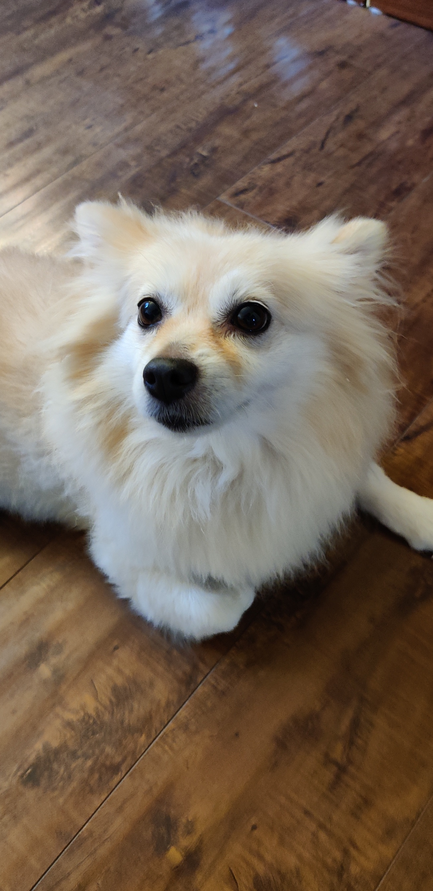
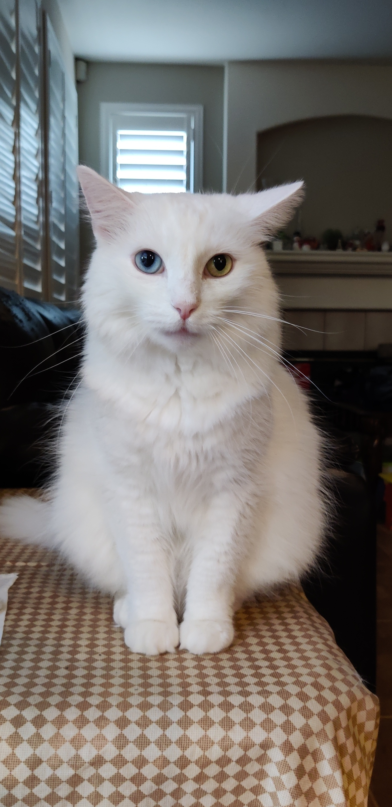

## Benjamin Kuo

* [Videogames](#videogames-i-play)
* [Pets](#pets)
* [My PC](#my-pc)
* [GME](#gme)

# Videogames I play
Apex Legends (https://www.ea.com/games/apex-legends)
> Apex Legends is a free-to-play battle royale-hero shooter game developed by Respawn Entertainment and published by Electronic Arts.

Genshin Impact (https://genshin.mihoyo.com/en/)
> Genshin Impact is an action role-playing game developed and published by Chinese video game development and animation studio miHoYo.

Ark: Survival Evolved (https://store.steampowered.com/app/346110/ARK_Survival_Evolved/)
> Ark: Survival Evolved is a 2017 action-adventure survival video game developed by Studio Wildcard, in collaboration with Instinct Games, Efecto Studios, and Virtual Basement.

# Pets
1. Dog *Bella*

2. Cat *Mimi*

3. Tortoises *Mochi and Fochi*
4. Fishes *I got no clue*

# My PC
- [x] Ryzen 5 3600 w/ stock cooler
- [ ] Deepcool 360mm AIO 
- [x] RTX 2060 Super Founders Edition
- [x] MSI B450 Carbon Max Wifi
- [x] 16GB RGB Trident 3600mhz (running @ 3200mhz)
- [x] Corsair 80+ Gold 650W Fully Modular
- [x] Custom white cable sleeved 
- [x] Lian Li PC-O11-Dynamic

# GME 
The stock market is a fraud and those behind the massive short selling are the same entities that caused the housing crisis back in 2008. 
In addition, we are currently underway to reliving 2008 but at a far greater magnitude. The DTCC, SEC, Fed, and other government and 
non-government entities are complicit and have allowed countless illegal activites to persist in not only US markets but in foreign ones
as well. This is not a conspiracy theory as extensive research has dated back since the creation of the stock market. For more information, 
go to [GMEdd.com](https://gmedd.com) and [Superstonk](https://www.reddit.com/r/Superstonk/).